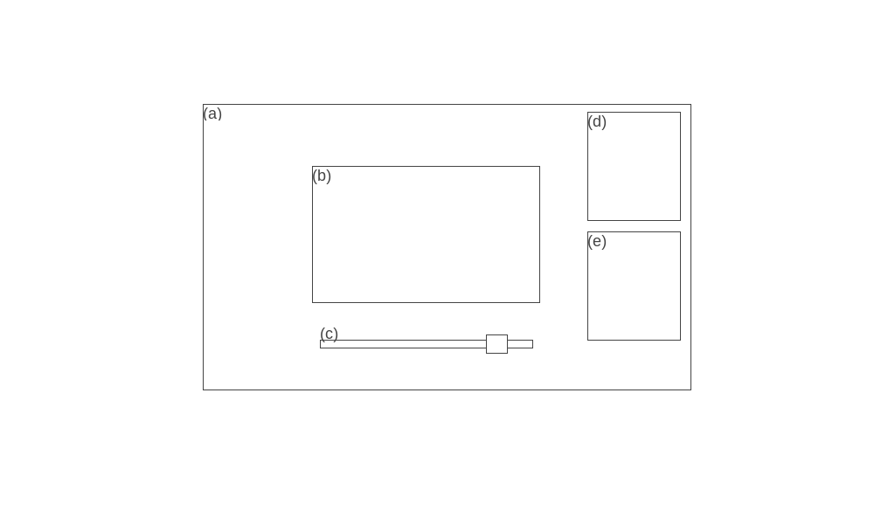
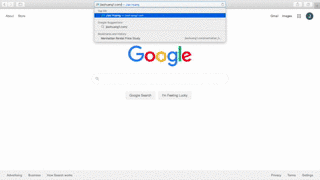
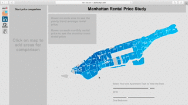
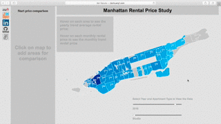

## Manhattan_housing: A data visualization of rental price in Manhattan changing over the years

### Overview
This data reflects the rental price of different types of apartments changing over the years in Manhattan. It can be used to predict the future trends of the housing price in manhattan region.

### Functionality & MVP
Manhattan_housing users are able to:
- [ ] See a manhattan geography map of the rental prices of different types of housing at different zipcode
- [ ] Click on the year and/or apartment type slider to review the specific year and apartment type of the rental prices
- [ ] Hover on the map to review the a specific neighborhood rental price trends
- [ ] Click on the map to compare rental price at different region and neighborhood

### Data & APIs
* Rental price by zipcode and year through zillow
* Manhattan geojson data
* zipcode vs latitude and longitude

### Wireframe
This visualization consists of a single screen (a) containing a map with rental price graph (b), which is interative by years through the time bar (c) or the apartment type selection (e). It also have a block (d) to display the range of prices represented by colors.

### Design
Bar height changes dynamically based on year and location of the rental apartment. On dragging the time and apartment type bar, the rental price of the corresponding year and apartment type on the location will be displayed at correct color on the map. 

Hover on the map, neighborhood rental price trends will be display in barchart format

Click on the map, the rental price of specific year, apartment type and location will be add to compare price section.

### Architecture & Technologies
* `JavaScript` for data retrieval and computation
* `D3.JS` + `HTML5` + `CSS` for interactive visualization
* `Webpack` + `Babel` to bundle js files

### Feature Highlights
* Double slider: year vs apartment type

* Hover effect to see the barchart of manhattan rental price trends

* Click to compare rental price

